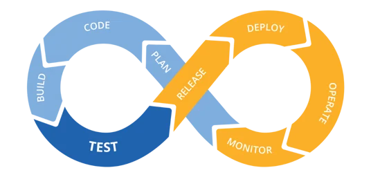
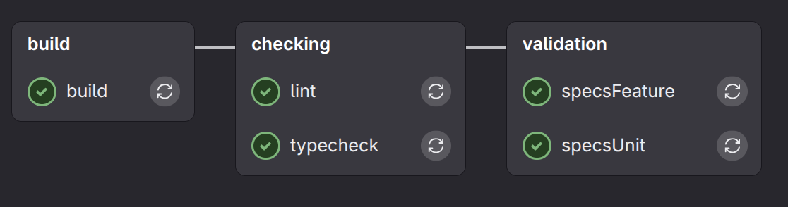
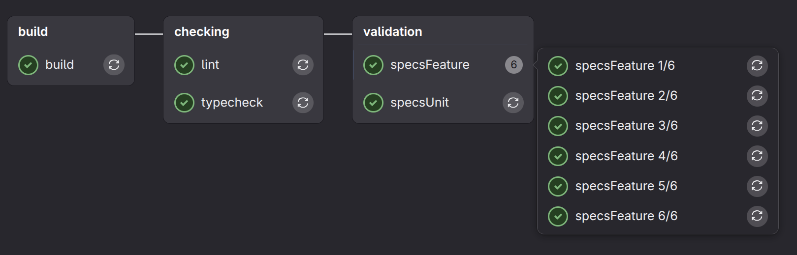

<h1>
  <span class="primary">Otimização</span> de <span class="tertiary">CI/CD</span> para Aplicações <span class="secondary">NestJS</span>
</h1>


---
layout: content
displayPageNumber: false
---

# Sumário

<ul class="mt-sm">
  <li>
    <Link to="context">Contexto</Link>
    <ul>
      <li><Link to="what-is-ci-and-cd">O que é CI/CD?</Link></li>
      <li><Link to="project-structure">Estrutura do Projeto</Link></li>
      <li><Link to="technologies-and-architecture-used">Tecnologias e Arquitetura Utilizadas</Link></li>
    </ul>
  </li>

  <li>
    <Link to="problem">O Problema</Link>
  </li>

  <li>
    <Link to="implemented-improvements">Melhorias Implementadas</Link>
    <ul>
      <li><Link to="mocks">Padronização de Mocks</Link></li>
      <li><Link to="unit-tests">Testes Unitários sem Dependências Externas</Link></li>
      <li><Link to="e2e-tests">Testes E2E com Shard e Parallel</Link></li>
    </ul>
  </li>

  <li>
    <Link to="results">Resultados Obtidos</Link>
  </li>

  <li>
    <Link to="conclusion">Conclusão</Link>
  </li>
</ul>

---
layout: center
routeAlias: context
---

# Contexto

---
layout: content
routeAlias: what-is-ci-and-cd
subject: O que é CI/CD?
---

- **Continuous Integration (CI)**: Refere-se a integração continua do código-fonte da aplicação no repositório<sup>1</sup> principal.
- **Continuous Deployment (CD)**: Extensão do processo acima, garantindo que as mudanças sejam automaticamente implantadas nos ambientes<sup>2</sup> referentes (produção/testes)



<footer class="absolute bottom-0 left-10 right-0">
  <blockquote style="width: 720px">
    <i><sup>1</sup> Um repositório é como uma <b>pasta compartilhada com histórico</b>.</i>
    <br>
    <i><sup>2</sup> Um ambiente resumidamente se refere ao <b>lugar onde o código final roda</b>.</i>
  </blockquote>
</footer>

---
layout: content
subject: Benefícios do CI/CD
---

- **Maior agilidade:** O feedback ágil do processo de implantação reduz o tempo entre a escrita e disponibilização do código.
- **Maior segurança e frequência:** O processo automatizado evita o desgaste comum de processos manuais de deploy/validação.
- **Antecipação de Erros:** Testes automatizados servem como um bloqueio final para problemas não capturados em testes locais.
- **Menos retrabalho:** Erros antecipados resultam em correções antecipadas, evitando tropeços no meio do caminho.

---
layout: content
routeAlias: project-structure
subject: Estrutura do Projeto
---

O projeto conta com quatro ambientes distintos:

- **Desenvolvimento**: Ambiente utilizado pelos desenvolvedores para testes e implementação de novas funcionalidades.
- **Homologação**: Utilizado pelos QAs (Quality Assurance) para validação de novas funcionalidades antes da liberação.
- **Demonstração**: Um ambiente semelhante à produção, usado como Sandbox por nossos parceiros.
- **Produção**: O ambiente final onde a aplicação é utilizada pelos usuários.

---
layout: content
subject: Estrutura do Projeto
---

Nosso pipeline de CI/CD é dividido em duas partes principais:

1. **CI de MRs/PRs**: Responsável por validar a integridade do código antes de ser mesclado na branch do ambiente.
2. **CI/CD da branch do ambiente**: Valida novamente o código e realiza a implantação no ambiente correspondente.

HotFixes são aplicados diretamente em demonstração, validados e depois propagados para os outros ambientes.


<footer class="absolute bottom-0 left-10 right-0">
  <blockquote style="width: 720px">
    <i>
      MR (Merge Request) é um processo utilizado em plataformas como GitLab para solicitar a integração de um conjunto de alterações em uma branch principal. É similar ao PR (Pull Request) utilizado no GitHub. 
    </i>
  </blockquote>
</footer>

---
layout: content
routeAlias: technologies-and-architecture-used
subject: Tecnologias e Arquitetura Utilizadas
---

O projeto segue uma arquitetura de **microsserviços**, onde cada serviço é responsável por uma funcionalidade específica e se comunica com outros serviços por meio de APIs e mensageria.

A otimização realizada neste contexto foi aplicada a um dos **microsserviços críticos da operação**, que desempenha um papel essencial no funcionamento do sistema. As tecnologias principais utilizadas incluem:

- **NestJS** para a aplicação backend.
- **GitLab** como ferramenta de CI/CD e versionamento de código.
- **Jest** para testes unitários e de integração.
- **Docker** para conteinerização e gerenciamento de dependências.

---
layout: center
routeAlias: problem
---

# O Problema

---
layout: content
subject: O Problema
routeAlias: problem-1
---

Um intervalo demasiadamente elevado para uma que uma correção crítica alcançasse produção, tomando em conta:

<div class="flex justify-between mt-xl">
  <ul>
    <li><b>~40 minutos</b> para a MR de demonstração.</li>
    <li><b>~1 hora</b> para a branch de demonstração.</li>
    <li><b>~40 minutos</b> para a MR de produção.</li>
    <li><b>~1 hora</b> para a branch de produção.</li>
  </ul>

  <div class="flex gap-4">
    
    
  </div>
</div>

<footer class="absolute bottom-0 left-10 right-0">
  <blockquote style="width: 720px">
    <i>
      Esse tempo adicional em relação a MR se dá por conta de etapas exclusivas ao processo de implantação.
    </i>
  </blockquote>
</footer>

---
layout: center
routeAlias: implemented-improvements
---

# Melhorias Implementadas

---
layout: content
routeAlias: mocks
subject: Padronização de Mocks
---

#### **Problema**

Diferentes abordagens para os mocks de teste resultavam em inconsistências e dificuldades na manutenção. Além disso, essa falta de padrão causava erros intermitentes no processo de CI/CD, quebrando os testes automatizados. Nisso, era necessário **rodar a mesma job inúmeras vezes até obter uma execução bem sucedida**, o que adicionava ao tempo de execução da pipeline.

#### **Solução**

Padronização de mocks por meio da biblioteca **Rosie**, tornando os testes mais consistentes e sustentáveis em manutenção.

<v-click>
```ts
export const agentConfigFactory = Factory.define<AgentConfigEntity>(
  'AgentConfigEntity',
)
  .attrs({
    id: () => faker.string.uuid(),
    //...other props
  })
  .after(toInstance(AgentConfigEntity));
```
</v-click>

---
layout: content
routeAlias: unit-tests
subject: Testes Unitários sem Dependências Externas
---

#### **Problema**

Havia dependência direta de muitos serviços "reais" (Redis, Postgres, Localstack) que não cabiam ao escopo de um teste unitário<sup>1</sup>, causando um overhead desnecessário na execução.

#### **Solução**

Remoção de todas dependências em favor de mocks, reduzindo significativamente o tempo de execução.

<footer class="absolute bottom-0 left-10 right-0">
  <blockquote style="width: 720px">
    <i>
      <sup>1</sup> Teste isolado de uma unidade de código, focando em sua implementação sem nenhuma dependência externa.
    </i>
  </blockquote>
</footer>

---
layout: content
subject: Testes Unitários sem Dependências Externas
---

<<< ./src/snippets/docker-compose.yaml {13,14,15,16}{lines:true}

---
layout: content
subject: Testes Unitários sem Dependências Externas
---
<v-click>
<b class="text-xs">Antes:</b>

```yaml {5,6,7,8}
specsUnit:
  script:
    - docker login -u $CI_REGISTRY_USER -p $CI_REGISTRY_PASSWORD $CI_REGISTRY
    - docker pull $CONTAINER_RELEASE_IMAGE
    - docker-compose -f docker-compose.ci.yml run --rm app yarn
    - docker-compose -f docker-compose.ci.yml run --rm app yarn db:create
    - docker-compose -f docker-compose.ci.yml run --rm app yarn db:migrate
    - docker-compose -f docker-compose.ci.yml run -e ci=true --rm app yarn test:u
```
</v-click>

<v-click>
<b class="text-xs">Depois:</b>

```yaml {5}
specsUnit:
  script:
    - docker login -u $CI_REGISTRY_USER -p $CI_REGISTRY_PASSWORD $CI_REGISTRY
    - docker pull $CONTAINER_RELEASE_IMAGE
    - docker-compose -f docker-compose.ci.yml run -e ci=true --rm --no-deps app yarn test:u
```
</v-click>

---
layout: center
routeAlias: e2e-tests
---

# Testes E2E com Shard e Parallel

---
layout: content
subject: O que é Shard no Jest?
---

Shard se refere a fragmento em inglês, que exemplifica o processo de Sharding no Jest, que implica a execução dos testes em "fragmentos" menores do processo total.

**Exemplo de uso do Shard no Jest:**

```sh
jest --shard=1/3
```
<br>

No exemplo acima, estamos executando o primeiro de três shards, ou seja, dividimos os testes em três partes e estamos rodando apenas uma delas.

---
layout: content
subject: O que é Parallel no GitLab CI?
---

Parallel no GitLab CI permite rodar múltiplas instâncias de uma mesma job simultaneamente, distribuindo a execução dos testes em diferentes máquinas virtuais.

**Exemplo de Parallel no GitLab CI:**

```yaml
test-e2e:
  script:
    - npm run test:e2e
  parallel: 3 # Executará a job em 3 instâncias simultâneas
```

---
layout: content
subject: O que é Parallel no GitLab CI?
displayPageNumber: false
---

<div class="flex flex-col gap-1">
  <b class="text-xs">Antes:</b>

  
</div>

<div v-click="1">
  <b class="text-xs">Depois:</b>

  
</div>


---
layout: center
routeAlias: results
---

# Resultados Obtidos

---
layout: content
subject: Resultados Obtidos
---

Após a implementação das otimizações, os tempos de execução do CI/CD foram significativamente reduzidos:

- **CI de MRs/PRs** passou de \~40 minutos para **15 minutos**.
- **CI/CD da branch do ambiente** passou de \~1 hora para **35 minutos**.

<div class="flex gap-4 mt-xl w-full justify-center">
  
  
</div>

---
layout: center
routeAlias: conclusion
---

# Conclusão

---
layout: content
subject: Referências
routeAlias: references
---

- [Jest Shard](https://jestjs.io/pt-BR/docs/next/cli#--shard)
- [Speed up your Jest tests with shards](https://medium.com/@mfreundlich1/speed-up-your-jest-tests-with-shards-776e9f02f637)

---
layout: center
routeAlias: links
---

[Slides](gentle-platypus-c62685.netlify.app) · [GitHub](https://github.com/luweslen/otimizaco-de-ci-cd-para-aplicaces-nestjs)

<PoweredBySlidev mt-2 />

---
layout: end
email: luciano.weslen@zrp.com.br
website: zrp.com.br
---

# Muito obrigado!

Se ficou com dúvidas a respeito de uma ou mais partes deste documento, não hesite em entrar em contato conosco.
