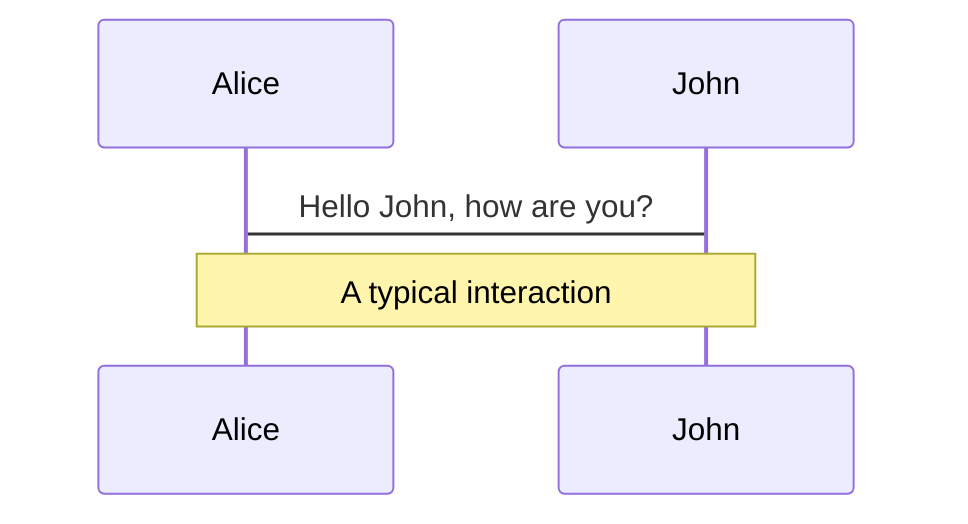
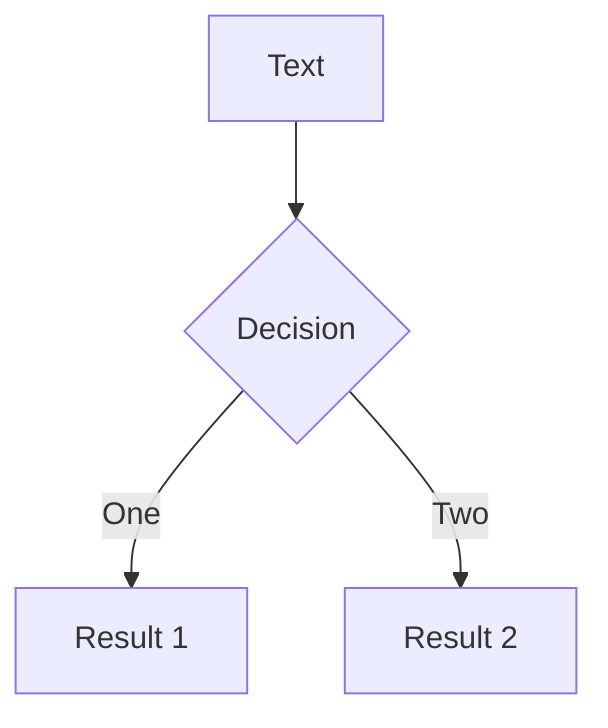
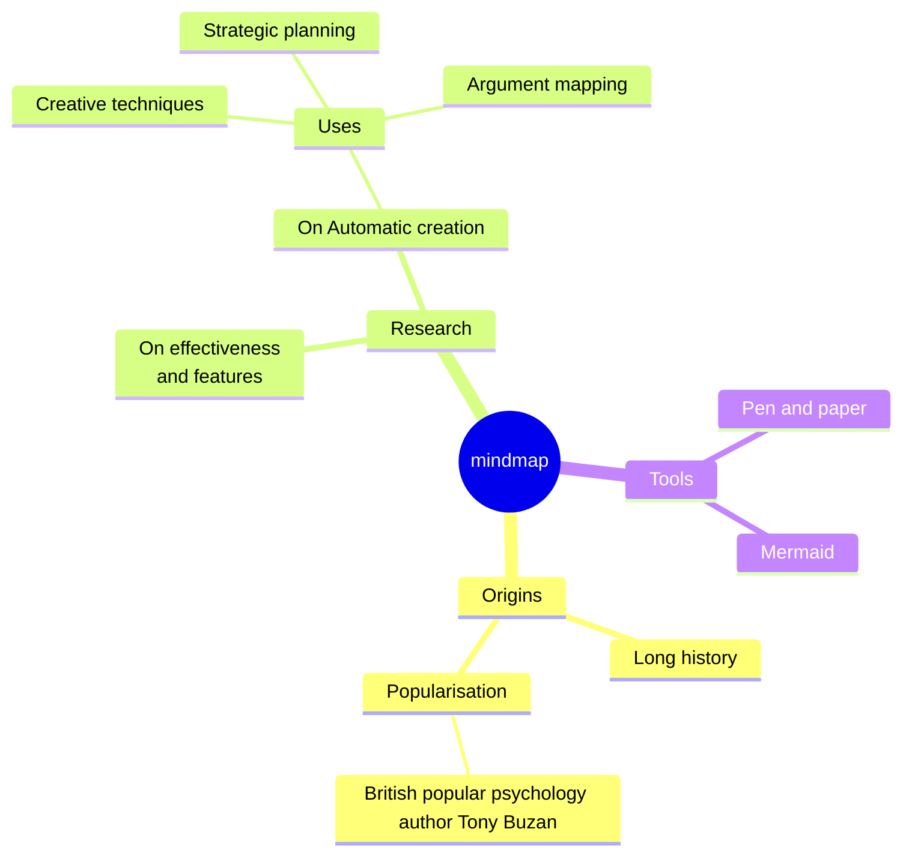
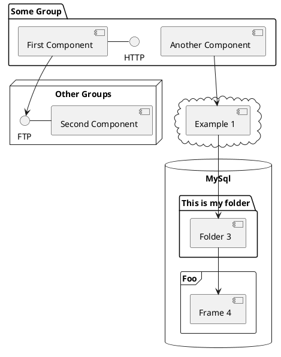

# Otimização de CI/CD para Aplicações NestJS


---
transition: fade-out
layout: content
---

# Sumário

<ul>
  <li>
    <Link to="context">Contexto</Link>
    <ul>
      <li><Link to="what-is-ci-and-cd">O que é CI/CD?</Link></li>
      <li><Link to="project-structure">Estrutura do Projeto</Link></li>
      <li><Link to="technologies-and-architecture-used">Tecnologias e Arquitetura Utilizadas</Link></li>
    </ul>
  </li>

  <li>
    <Link to="problem">O Problema</Link>
  </li>

  <li>
    <Link to="implemented-improvements">Melhorias Implementadas</Link>
    <ul>
      <li><Link to="mocks">Padronização de Mocks</Link></li>
      <li><Link to="unit-tests">Testes Unitários sem Dependências Externas</Link></li>
      <li><Link to="e2e-tests">Testes E2E com Shard e Parallel</Link></li>
    </ul>
  </li>

  <li>
    <Link to="results">Resultados Obtidos</Link>
  </li>

  <li>
    <Link to="conclusion">Conclusão</Link>
  </li>
</ul>

---
layout: center
routeAlias: context
---

# Contexto


---
layout: content
routeAlias: what-is-ci-and-cd
---

# O que é CI/CD?

CI/CD (Continuous Integration/Continuous Deployment) é um conjunto de práticas que visa automatizar e otimizar o desenvolvimento de software, garantindo que novos códigos sejam integrados e implantados de maneira eficiente e segura.

- **Continuous Integration (CI)**: Refere-se à prática de integrar frequentemente as mudanças de código ao repositório principal. Isso permite que problemas sejam detectados e corrigidos rapidamente, pois cada alteração passa por testes automatizados antes de ser mesclada.
- **Continuous Deployment (CD)**: É a extensão natural da CI, garantindo que as mudanças aprovadas sejam automaticamente implantadas nos ambientes de produção ou de testes, reduzindo a intervenção manual e aumentando a confiabilidade das entregas.

---
layout: content
---

# Benefícios do CI/CD

Implementar um pipeline de CI/CD traz diversos benefícios, entre eles:

- **Maior agilidade no desenvolvimento**: O feedback rápido sobre novas implementações reduz o tempo entre a escrita do código e sua disponibilização.
- **Detecção antecipada de erros**: Testes automatizados ajudam a identificar problemas antes que cheguem à produção.
- **Menos retrabalho**: Como os erros são encontrados mais cedo, é mais fácil e barato corrigi-los.
- **Implantações mais seguras e frequentes**: Reduzindo riscos e melhorando a confiabilidade dos sistemas.
- **Automatização de processos repetitivos**: Permitindo que a equipe foque em desenvolvimento ao invés de tarefas operacionais.

---
layout: content
routeAlias: project-structure
---

# Estrutura do Projeto

Nosso projeto possui uma arquitetura baseada em microsserviços e conta com quatro ambientes distintos:

- **Desenvolvimento**: Ambiente utilizado pelos desenvolvedores para testes e implementação de novas funcionalidades.
- **Homologação**: Utilizado pelos QAs (Quality Assurance) para validação de novas funcionalidades antes da liberação.
- **Demonstração**: Um ambiente semelhante à produção, usado como Sandbox por nossos parceiros.
- **Produção**: O ambiente final onde a aplicação é utilizada pelos usuários.

---
layout: content
---

# Estrutura do Projeto

Nosso pipeline de CI/CD é dividido em duas partes principais:


1. **CI de MRs/PRs**: Responsável por validar a integridade do código antes de ser mesclado na branch do ambiente.
2. **CI/CD da branch do ambiente**: Valida novamente o código e realiza a implantação no ambiente correspondente.

HotFixes são aplicados diretamente em produção, validados e depois propagados para os outros ambientes.

> **Nota:** MR (Merge Request) é um processo utilizado em plataformas como GitLab para solicitar a integração de um conjunto de alterações em uma branch principal. É similar ao PR (Pull Request) utilizado no GitHub.

---
layout: content
routeAlias: technologies-and-architecture-used
---

# Tecnologias e Arquitetura Utilizadas

O projeto segue uma arquitetura de **microsserviços**, onde cada serviço é responsável por uma funcionalidade específica e se comunica com outros serviços por meio de APIs e mensageria.

A otimização realizada neste contexto foi aplicada a um dos **microsserviços críticos da operação**, que desempenha um papel essencial no funcionamento do sistema. As tecnologias principais utilizadas incluem:

- **NestJS** para a aplicação backend.
- **GitLab** como ferramenta de CI/CD e versionamento de código.
- **Jest** para testes unitários e de integração.
- **Docker** para conteinerização e gerenciamento de dependências.

---
layout: center
routeAlias: problem
---

# O Problema

---
layout: content
routeAlias: problem-1
---

# O Problema

---
layout: center
routeAlias: implemented-improvements
---

# Melhorias Implementadas

---
layout: content
routeAlias: mocks
---

# Padronização de Mocks

---
layout: content
routeAlias: unit-tests
---

# Testes Unitários sem Dependências Externas

---
layout: content
routeAlias: e2e-tests
---

# Testes E2E com Shard e Parallel

---
layout: center
routeAlias: results
---

# Resultados Obtidos

---
layout: center
routeAlias: conclusion
---

# Conclusão

---
layout: end
email: luciano.weslen@zrp.com.br
website: zrp.com.br
---

# Muito obrigado!

Se ficou com dúvidas a respeito de uma ou mais partes deste documento, não hesite em entrar em contato conosco.


---
level: 2
---

# Navigation

Hover on the bottom-left corner to see the navigation's controls panel, [learn more](https://sli.dev/guide/ui#navigation-bar)

## Keyboard Shortcuts

|                                                     |                             |
| --------------------------------------------------- | --------------------------- |
| <kbd>right</kbd> / <kbd>space</kbd>                 | next animation or slide     |
| <kbd>left</kbd>  / <kbd>shift</kbd><kbd>space</kbd> | previous animation or slide |
| <kbd>up</kbd>                                       | previous slide              |
| <kbd>down</kbd>                                     | next slide                  |

<!-- https://sli.dev/guide/animations.html#click-animation -->

<p v-after class="absolute bottom-23 left-45 opacity-30 transform -rotate-10">Here!</p>

---
layout: two-cols
layoutClass: gap-16
---

# Table of contents

You can use the `Toc` component to generate a table of contents for your slides:

```html
<Toc minDepth="1" maxDepth="1" />
```

The title will be inferred from your slide content, or you can override it with `title` and `level` in your frontmatter.

::right::

<Toc text-sm minDepth="1" maxDepth="2" />

---
layout: image-right
image: https://cover.sli.dev
---

# Code

Use code snippets and get the highlighting directly, and even types hover!

```ts {all|5|7|7-8|10|all} twoslash
// TwoSlash enables TypeScript hover information
// and errors in markdown code blocks
// More at https://shiki.style/packages/twoslash

import { computed, ref } from 'vue'

const count = ref(0)
const doubled = computed(() => count.value * 2)

doubled.value = 2
```

<arrow v-click="[4, 5]" x1="350" y1="310" x2="195" y2="334" color="#953" width="2" arrowSize="1" />

<!-- This allow you to embed external code blocks -->
<<< @/snippets/external.ts#snippet

<!-- Footer -->

[Learn more](https://sli.dev/features/line-highlighting)

<!-- Inline style -->
<style>
.footnotes-sep {
  @apply mt-5 opacity-10;
}
.footnotes {
  @apply text-sm opacity-75;
}
.footnote-backref {
  display: none;
}
</style>

<!--
Notes can also sync with clicks

[click] This will be highlighted after the first click

[click] Highlighted with `count = ref(0)`

[click:3] Last click (skip two clicks)
-->

---
level: 2
---

# Shiki Magic Move

Powered by [shiki-magic-move](https://shiki-magic-move.netlify.app/), Slidev supports animations across multiple code snippets.

Add multiple code blocks and wrap them with <code>````md magic-move</code> (four backticks) to enable the magic move. For example:

````md magic-move {lines: true}
```ts {*|2|*}
// step 1
const author = reactive({
  name: 'John Doe',
  books: [
    'Vue 2 - Advanced Guide',
    'Vue 3 - Basic Guide',
    'Vue 4 - The Mystery'
  ]
})
```

```ts {*|1-2|3-4|3-4,8}
// step 2
export default {
  data() {
    return {
      author: {
        name: 'John Doe',
        books: [
          'Vue 2 - Advanced Guide',
          'Vue 3 - Basic Guide',
          'Vue 4 - The Mystery'
        ]
      }
    }
  }
}
```

```ts
// step 3
export default {
  data: () => ({
    author: {
      name: 'John Doe',
      books: [
        'Vue 2 - Advanced Guide',
        'Vue 3 - Basic Guide',
        'Vue 4 - The Mystery'
      ]
    }
  })
}
```

Non-code blocks are ignored.

```vue
<!-- step 4 -->
<script setup>
const author = {
  name: 'John Doe',
  books: [
    'Vue 2 - Advanced Guide',
    'Vue 3 - Basic Guide',
    'Vue 4 - The Mystery'
  ]
}
</script>
```
````

---

# Components

<div grid="~ cols-2 gap-4">
<div>

You can use Vue components directly inside your slides.

We have provided a few built-in components like `<Tweet/>` and `<Youtube/>` that you can use directly. And adding your custom components is also super easy.

```html
<Counter :count="10" />
```

<!-- ./components/Counter.vue -->
<Counter :count="10" m="t-4" />

Check out [the guides](https://sli.dev/builtin/components.html) for more.

</div>
<div>

```html
<Tweet id="1390115482657726468" />
```

<Tweet id="1390115482657726468" scale="0.65" />

</div>
</div>

<!--
Presenter note with **bold**, *italic*, and ~~striked~~ text.

Also, HTML elements are valid:
<div class="flex w-full">
  <span style="flex-grow: 1;">Left content</span>
  <span>Right content</span>
</div>
-->

---
class: px-20
---

# Themes

Slidev comes with powerful theming support. Themes can provide styles, layouts, components, or even configurations for tools. Switching between themes by just **one edit** in your frontmatter:

<div grid="~ cols-2 gap-2" m="t-2">

```yaml
---
theme: default
---
```

```yaml
---
theme: seriph
---
```


</div>

Read more about [How to use a theme](https://sli.dev/guide/theme-addon#use-theme) and
check out the [Awesome Themes Gallery](https://sli.dev/resources/theme-gallery).

---

# Clicks Animations

You can add `v-click` to elements to add a click animation.

<div v-click>

This shows up when you click the slide:

```html
<div v-click>This shows up when you click the slide.</div>
```

</div>

<br>

<v-click>

The <span v-mark.red="3"><code>v-mark</code> directive</span>
also allows you to add
<span v-mark.circle.orange="4">inline marks</span>
, powered by [Rough Notation](https://roughnotation.com/):

```html
<span v-mark.underline.orange>inline markers</span>
```

</v-click>

<div mt-20 v-click>

[Learn more](https://sli.dev/guide/animations#click-animation)

</div>

---

# Motions

Motion animations are powered by [@vueuse/motion](https://motion.vueuse.org/), triggered by `v-motion` directive.

```html
<div
  v-motion
  :initial="{ x: -80 }"
  :enter="{ x: 0 }"
  :click-3="{ x: 80 }"
  :leave="{ x: 1000 }"
>
  Slidev
</div>
```

<div class="w-60 relative">
  <div class="relative w-40 h-40">
    
    
    
  </div>

  <div
    class="text-5xl absolute top-14 left-40 text-[#2B90B6] -z-1"
    v-motion
    :initial="{ x: -80, opacity: 0}"
    :enter="{ x: 0, opacity: 1, transition: { delay: 2000, duration: 1000 } }">
    Slidev
  </div>
</div>

<!-- vue script setup scripts can be directly used in markdown, and will only affects current page -->
<script setup lang="ts">
const final = {
  x: 0,
  y: 0,
  rotate: 0,
  scale: 1,
  transition: {
    type: 'spring',
    damping: 10,
    stiffness: 20,
    mass: 2
  }
}
</script>

<div
  v-motion
  :initial="{ x:35, y: 30, opacity: 0}"
  :enter="{ y: 0, opacity: 1, transition: { delay: 3500 } }">

[Learn more](https://sli.dev/guide/animations.html#motion)

</div>

---

# LaTeX

LaTeX is supported out-of-box. Powered by [KaTeX](https://katex.org/).

<div h-3 />

Inline $\sqrt{3x-1}+(1+x)^2$

Block
$$ {1|3|all}
\begin{aligned}
\nabla \cdot \vec{E} &= \frac{\rho}{\varepsilon_0} \\
\nabla \cdot \vec{B} &= 0 \\
\nabla \times \vec{E} &= -\frac{\partial\vec{B}}{\partial t} \\
\nabla \times \vec{B} &= \mu_0\vec{J} + \mu_0\varepsilon_0\frac{\partial\vec{E}}{\partial t}
\end{aligned}
$$

[Learn more](https://sli.dev/features/latex)

---

# Diagrams

You can create diagrams / graphs from textual descriptions, directly in your Markdown.

<div class="grid grid-cols-4 gap-5 pt-4 -mb-6">









</div>

Learn more: [Mermaid Diagrams](https://sli.dev/features/mermaid) and [PlantUML Diagrams](https://sli.dev/features/plantuml)

---
foo: bar
dragPos:
  square: 691,32,167,_,-16
---

# Draggable Elements

Double-click on the draggable elements to edit their positions.

<br>

###### Directive Usage

```md

```

<br>

###### Component Usage

```md
<v-drag text-3xl>
  <div class="i-carbon:arrow-up" />
  Use the `v-drag` component to have a draggable container!
</v-drag>
```

<v-drag pos="663,206,261,_,-15">
  <div text-center text-3xl border border-main rounded>
    Double-click me!
  </div>
</v-drag>


###### Draggable Arrow

```md
<v-drag-arrow two-way />
```

<v-drag-arrow pos="67,452,253,46" two-way op70 />

---
src: ./pages/imported-slides.md
hide: false
---

---

# Monaco Editor

Slidev provides built-in Monaco Editor support.

Add `{monaco}` to the code block to turn it into an editor:

```ts {monaco}
import { ref } from 'vue'
import { emptyArray } from './external'

const arr = ref(emptyArray(10))
```

Use `{monaco-run}` to create an editor that can execute the code directly in the slide:

```ts {monaco-run}
import { version } from 'vue'
import { emptyArray, sayHello } from './external'

sayHello()
console.log(`vue ${version}`)
console.log(emptyArray<number>(10).reduce(fib => [...fib, fib.at(-1)! + fib.at(-2)!], [1, 1]))
```

---
layout: center
class: text-center
---

# Learn More

[Documentation](https://sli.dev) · [GitHub](https://github.com/slidevjs/slidev) · [Showcases](https://sli.dev/resources/showcases)

<PoweredBySlidev mt-10 />
